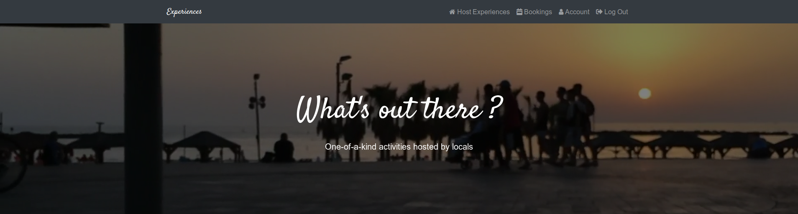

# experiences-app
for SEI-CC-4, project 3

# Experiences App

Experiences is a Python Django based application for finding activities around various locations Also allows user the ability to host events or as we like to call them Experiences.

## Installation

No installation nesscary you can just go to this link.

[Experiences Application get started here](experiencesapp.herokuapp.com "Experiences app")

## Technologies Used

- Python3
- Django
- Html
- CSS
- JavaScript
- Heroku
- Unsplash api (for random image generation)
- (future ICEBOX) Google Places API
- (future ICEBOX) Stripe payment processing API

## The Pitch and our Planing 
[Pitch Presentation](https://docs.google.com/presentation/d/1DNAjXGBXbbPf6wL9p9H0ejlKsjO_Jow6QXtbjNTSpVk/edit?usp=sharing)
 
[Trello](https://trello.com/b/XF41OcI0/airbnb-experiences)

###future plans
-payment processing
-map and location
-improve the nav bar
-improve img uploading flexability for users

## License 
[MIT](https://choosealicense.com/licenses/mit/)

